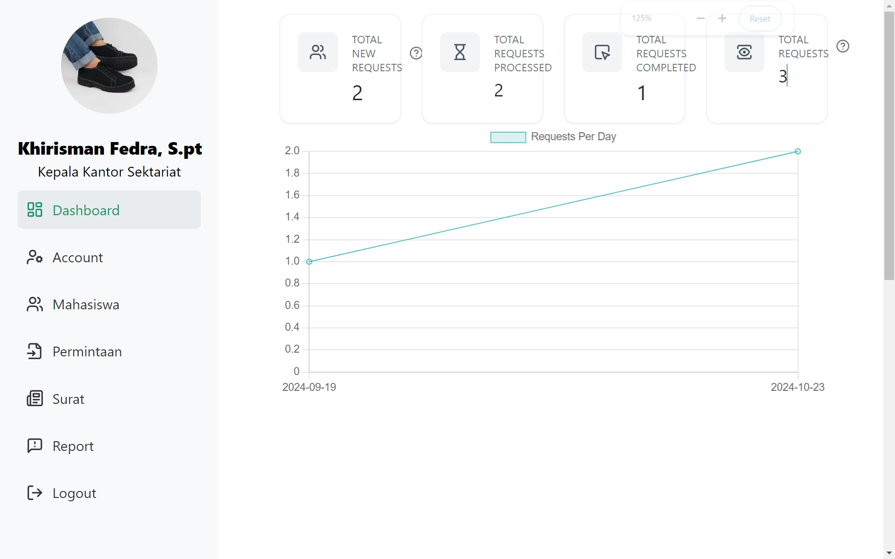
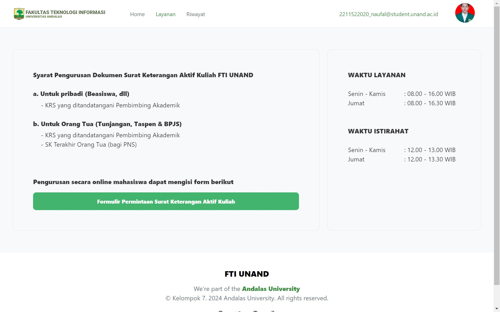
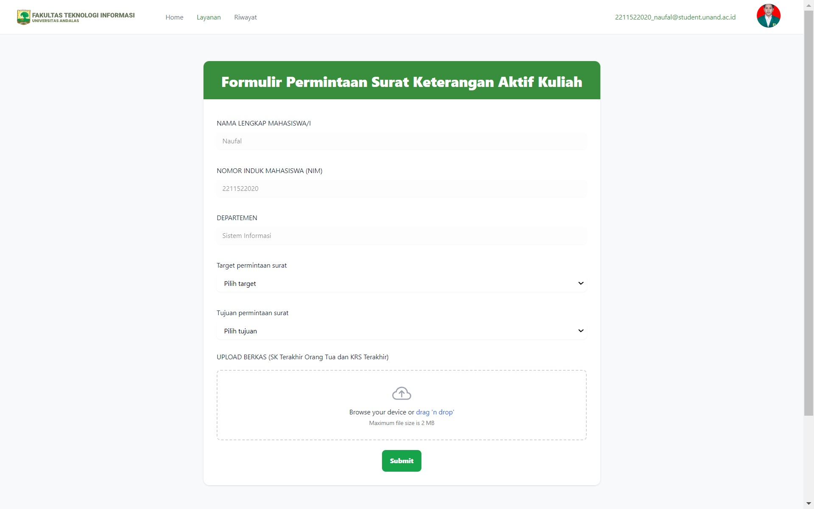
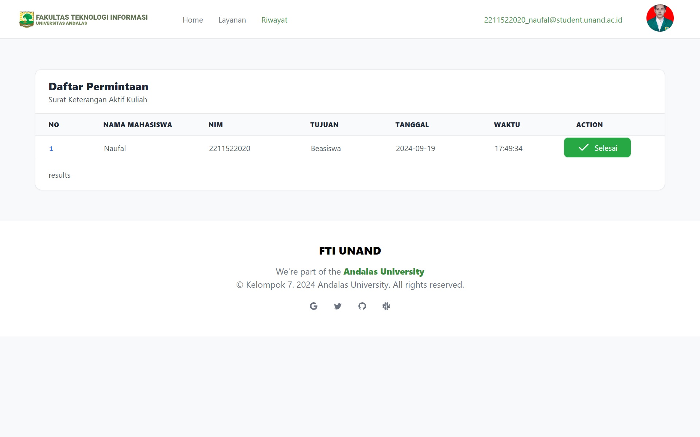
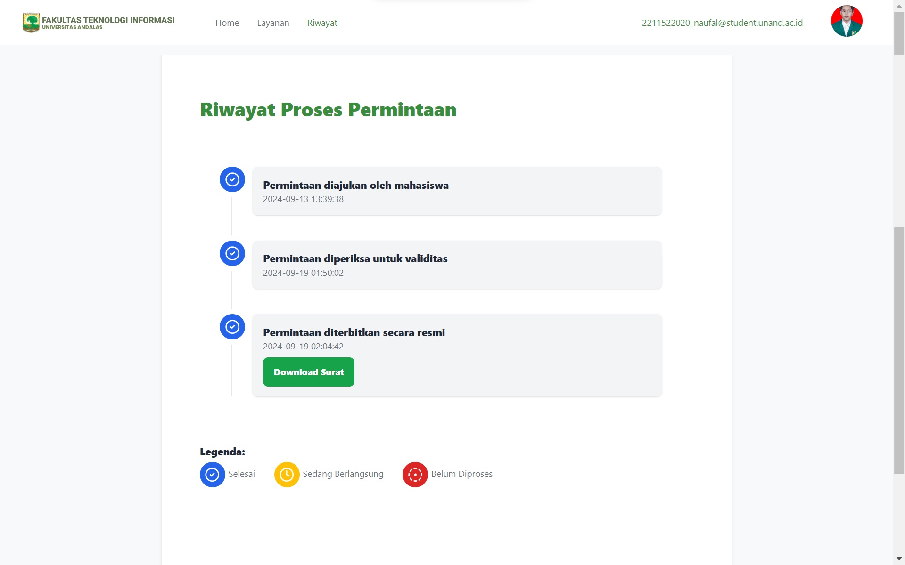
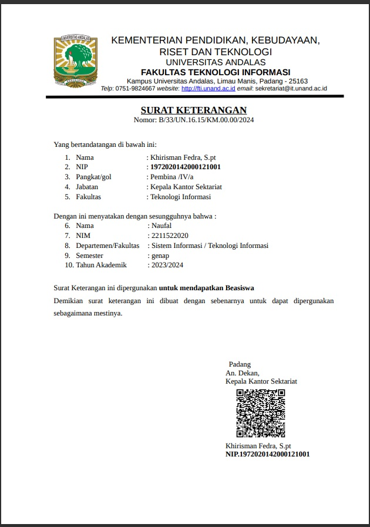

# Academic Enrollment Letter Request System with QR Code Verification

This web-based application is designed to streamline the process of requesting an official academic enrollment letter, commonly used by students for administrative purposes. The system integrates QR code verification, allowing administrators and external parties to verify the authenticity of the issued letters.

## Live Demo

The application is live and can be accessed at:
**[aktifkuliah.techfuture.my.id](https://aktifkuliah.techfuture.my.id/)**

## Features

- **User Authentication**: Secure login for students, administrators, and external users.
- **Enrollment Letter Request**: Students can submit requests for academic enrollment letters with a user-friendly interface.
- **Generate PDF Letters**: Automatically generate letters based on the data of the student who submitted the request.
- **QR Code Generation**: Automatically generates a unique QR code for each issued letter, ensuring authenticity.
- **QR Code Verification**: External parties and administrators can scan the QR code to verify the letter.
- **Letter Management**: Administrators can approve or reject requests and manage all letters issued.
- **Responsive Design**: Accessible from both desktop and mobile devices.

## Tech Stack

- **Frontend**: HTML, Preline CSS, JavaScript
- **Backend**: Node.js, Express.js
- **Database**: MySQL (or any other relational database)
- **QR Code Library**: QRCode.js
- **Authentication**: JWT (JSON Web Token)
- **Cloud Hosting**: Alibaba Cloud Virtual Machine (CentOS)

## Usage

- **Access the login page and sign in as a student or administrator.
- **Students can request an academic enrollment letter by filling out a form.
- **Once the letter is approved, a QR code is generated and embedded in the letter.
- **Administrators can view, approve, or reject the requests.
- **External users can verify the letter by scanning the QR code, which will direct them to a verification page.

## Screenshots

### 1. **Login**

### 2. **Homepage**

### 3. **Dashboard**

### 4. **Layanan**

### 5. **Layanan Form**

### 6. **Riwayat**

### 7. **Riwayat Detail**

### 8. **Surat**

